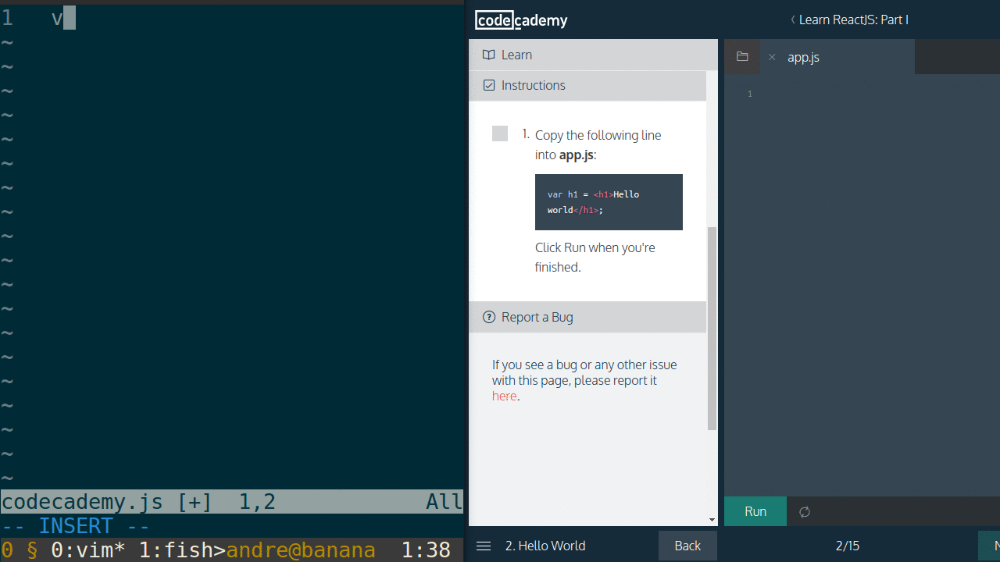

# codecademy-vim
Vim (Neovim) integration with Codecademy.

`<Leader>cs` moves code to web editor, and `<Leader>cr` runs the code. See *Progress* for current features.

*Disclaimer: This is a proof of concept/work in progress, created with no prior experience with python or plugin development for Vim.
The code is therefore subpar, and might not work properly.*

## Installation
1. Install the required dependencies via your favorite package manager and clone this project.
2. Make sure ChromeDriver is in the PATH environment variable.
4. Add your Codecademy login credentials to `credentials.txt`. Email in the first line and password in the second. (I should probably change this at some point.)
5. Start a Neovim instance with the `NVIM_LISTEN_ADDRESS=/tmp/nvim` variable.

   Eg. in bash: `NVIM_LISTEN_ADDRESS=/tmp/nvim nvim <filename>`
   or in fish: `env NVIM_LISTEN_ADDRESS=/tmp/nvim nvim <filename>`

6. Run codecademy.py: `python3 codecademy.py`

Note: You might have to add `set expandtab` to your .vimrc for indentation to work correctly when moving code to the Codecademy web editor.

## Aim
The aim is to be able to solve Codecademy programming lessons in Vim, with all Vim mappings and commands you are used to.
- Enter code from Vim into the Codecademy web editor with a Vim command
- Pull code from the web editor into Vim with a Vim command
- Run the code in the web editor with a Vim command
- Navigate different Codecademy lessons with Vim commands
- ...

## Progress
- [x] Automatically log into Codecademy on startup
- [x] Enter code into the web editor with mapping `<Leader>cs`
- [x] Pull code into from the web editor into Vim with mapping `<Leader>cg`
- [x] Run the code in the web editor with mapping `<Leader>cr`
- [ ] Improve documentation and how to use
- [ ] Support *normal* Vim (currently developed using Neovim)
- [ ] Support other web browsers than Chrome/Chromium
- [ ] Support customisability
- [ ] Improve code structure, error handling and general code quality
- [ ] ...

## Dependencies
- [Neovim](https://neovim.io/)
- [Python3](https://www.python.org/)
- [Python Selenium](https://pypi.python.org/pypi/selenium)
- [Chrome/Chromium](http://www.chromium.org/Home)
- [ChromeDriver](https://sites.google.com/a/chromium.org/chromedriver/)
- [Neovim python-client](https://github.com/neovim/python-client)
